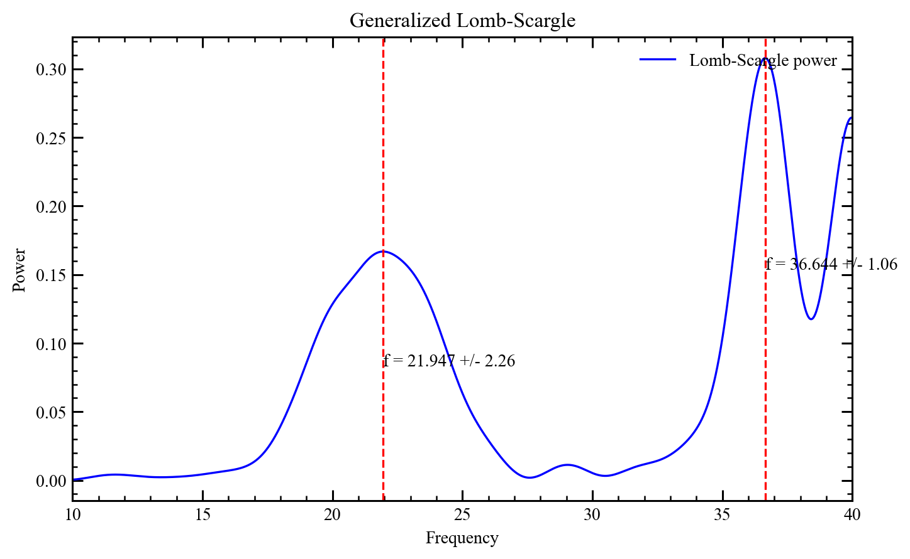
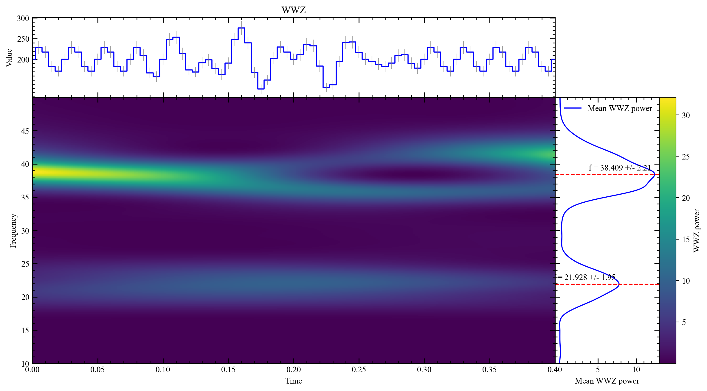
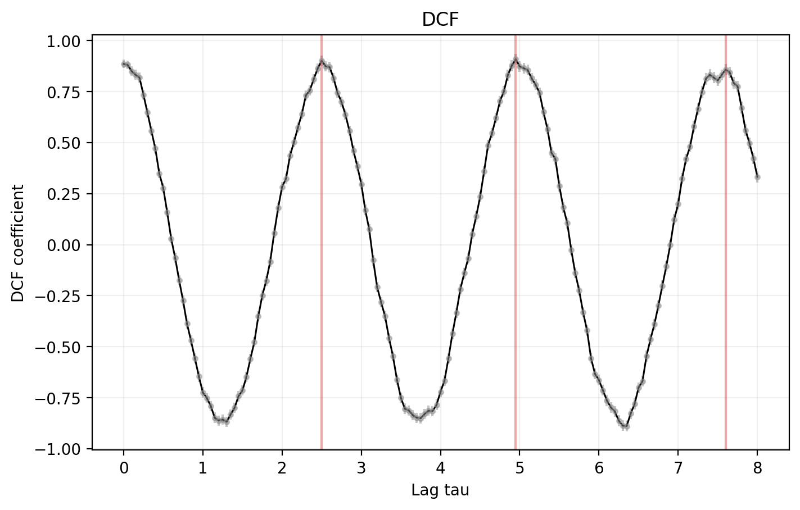
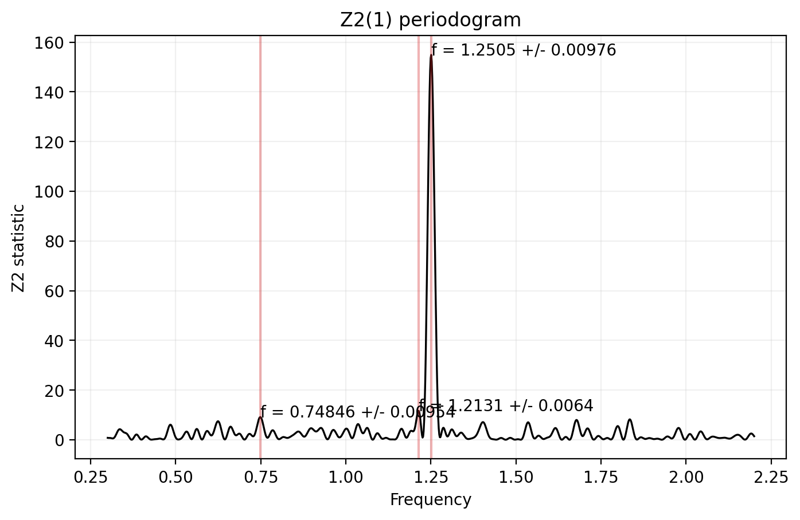
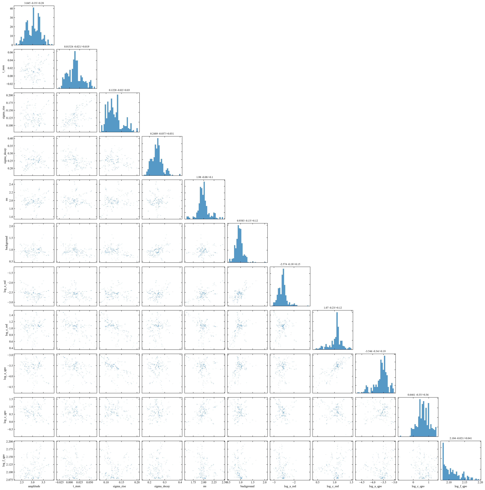

# BurstQPO 详细使用指南

这份文档按“数据准备 → 周期搜索 → 候选峰 → 统计显著性 → 贝叶斯建模 → 绘图和保存”的顺序介绍 BurstQPO。目标是让第一次接触 QPO 分析的用户也能知道：每个函数需要什么输入、每个参数改变什么、输出应该怎样读，以及什么时候不能把一个数值解释成“发现”。

文档针对当前仓库版本。函数名中的下划线前缀（例如 `_clean_inputs`）是实现细节，不属于稳定的用户 API；这里完整覆盖各模块的 `__all__` 导出函数、别名、结果对象和绘图入口。

## 1. 先建立整体概念

一次典型分析可以拆成以下步骤：

```text
原始事件/光变曲线
        │
        ├── 数据质量检查、统一时间单位、确定搜索范围
        │
        ├── 周期搜索：LSP / WWZ / Jurkevich / DCF / Z2n
        │             │
        │             └── result.find_peaks() 得到候选频率或周期
        │
        ├── 画图、保存 NPZ、检查窗口效应和峰宽
        │
        ├── 对 GRB 光变曲线：H0（背景+红噪声）与 H1（再加 QPO）建模
        │             │
        │             ├── MCMC：参数后验、诊断、QPO 物理量
        │             └── nested sampling：evidence 与 BF10
        │
        └── 使用不含 QPO 的 H0 后验做 posterior-predictive 显著性模拟
```

最重要的区别是：周期图回答“哪里有一个强的周期结构”，而模型比较和模拟回答“这个结构在合理的零假设下有多罕见”。不要把周期图上的最大值、MCMC 中的高频率后验或单个局部 p 值直接等同于 QPO 探测。

## 2. 安装和导入

### 2.1 安装

```bash
git clone https://github.com/LaoHTui/BurstQPO.git
cd BurstQPO
python -m pip install -e .
```

开发和 WWZ 加速依赖：

```bash
python -m pip install -e ".[dev,accelerated]"
```

核心依赖是 NumPy、SciPy、Matplotlib、Astropy、emcee 和 dynesty。Numba 是 WWZ 的可选加速器；没有 Numba 时，库使用 NumPy 参考实现，API 不变。

### 2.2 推荐导入方式

常用入口可以从顶层导入：

```python
from burstqpo import (
    dcf, jurkevich, lomb_scargle, lsp, wwz, z2n,
    calculate_significance, run_mcmc,
)
```

按主题导入时可以使用：

```python
from burstqpo.algorithms.peaks import find_periodogram_peaks
from burstqpo.bayesian import (
    add_kernels, bayes_factor, calculate_log_evidence,
    gp_log_likelihood, k_qpo, k_red_noise, set_prior,
)
from burstqpo.models import fred, constant_background
from burstqpo.significance import simulate_light_curves
from burstqpo.visualization import plot_mcmc_corner
```

`burstqpo.methods.*` 是保留的兼容导入路径，重新导出对应的算法；`burstqpo.significant` 是旧的显著性模块别名。新代码可直接使用 `burstqpo`、`burstqpo.algorithms` 或主题模块。

### 2.3 所有函数的共同约定

| 约定 | 说明 |
| --- | --- |
| `time` | 一维、有限的浮点数组。单位由用户决定，秒、天等都可以，但必须与频率或周期一致。 |
| `values` / `counts` | 与 `time` 等长的一维观测数组。周期搜索通常会删除 `time` 或 `values` 中的非有限行。 |
| `errors` / `uncertainty` | 一维正数测量误差。GP、GLSP 和显著性模拟要求严格为正；WWZ 允许有限非负值，但当前 WWZ 核心只保存它用于误差条，不用它加权。 |
| 频率 | `f` 的单位是 `1 / time_unit`。若 `time` 用秒，频率就是 Hz；若 `time` 用天，频率就是 day⁻¹。 |
| 周期 | `period = 1 / frequency`，单位与 `time` 相同。 |
| 输出文件 | `save_npz("name")` 会自动使用 `name.npz`；父目录不存在时会自动创建。 |
| 数组顺序 | LSP、WWZ、Jurkevich、Z2n 会把时间/频率/周期按升序整理；DCF 要求整理后时间严格递增。 |
| 异常 | 输入形状、有限性、正值条件不满足时通常抛出 `ValueError`；对象类型错误通常抛出 `TypeError`。 |

## 3. 第一个完整例子：Lomb-Scargle

下面的例子生成一个频率为 1.5 Hz 的非均匀采样信号。给出误差后，`mode="auto"` 会选择广义 Lomb-Scargle（GLSP）。

```python
import numpy as np
from burstqpo import lomb_scargle

rng = np.random.default_rng(42)
time = np.sort(rng.uniform(0.0, 20.0, 500))
uncertainty = 0.45 + 0.2 * rng.random(time.size)
values = 3.0 * np.sin(2.0 * np.pi * 1.5 * time)
values += rng.normal(0.0, uncertainty)

result = lomb_scargle(
    time, values, uncertainty=uncertainty,
    frequency_min=0.1, frequency_max=5.0, frequency_step=0.002,
    mode="auto", time_unit="s",
)

peak = result.find_peaks(top_n=1)[0]
print(result.mode)                  # glsp
print(peak["frequency"], peak["period"])
result.plot_lomb_scargle(show_peaks=True, save_path="lsp.png")
```



图中的蓝线是功率谱，红色虚线是 `show_peaks=True` 标出的候选峰。峰的误差来自局部高斯拟合宽度，适合描述网格上的峰宽，不等价于完整的噪声后验区间。

## 4. 周期搜索函数

### 4.1 `lomb_scargle`、`lsp`、`compute_lomb_scargle`、`compute_lsp`

四个名称指向同一个函数：

```python
lomb_scargle(
    time, values, uncertainty=None, *,
    frequencies=None,
    frequency_min=None, frequency_max=None, frequency_step=None,
    divide_freq_step=10.0,
    mode="auto", fit_mean=True, center_data=True,
    normalization="standard", time_unit="unknown",
)
```

参数：

| 参数 | 类型/默认值 | 用途 |
| --- | --- | --- |
| `time` | array-like | 观测时间，一维。非有限行会和对应观测一起删除，最后按时间升序排列。至少需要 3 个有限点。 |
| `values` | array-like | 光变曲线值，与 `time` 等长。 |
| `uncertainty` | `None` | 每个观测的 1-sigma 误差。给出并且所有值有限、严格大于 0 时才能做 GLSP。 |
| `frequencies` | 一维数组或 `None` | 自定义严格递增的正频率网格。使用它时不能同时给 `frequency_min/max/step`。 |
| `frequency_min` | 浮点数或 `None` | 自动网格下限。省略时为 `1 / (最大时间 - 最小时间)`。 |
| `frequency_max` | 浮点数或 `None` | 自动网格上限。省略时约为 `frequency_min * n_observation / 2`。 |
| `frequency_step` | 浮点数或 `None` | 自动网格步长。省略时使用 `frequency_min / divide_freq_step`。 |
| `divide_freq_step` | 正数，默认 `10.0` | 只有 `frequency_step=None` 时生效；值越大，网格越密。 |
| `mode` | `"auto"`、`"lsp"`、`"glsp"` | `auto` 根据误差是否有效自动选择；强制 `glsp` 时误差无效会抛出 `ValueError`。 |
| `fit_mean` | 布尔值，默认 `True` | 是否在 Astropy LombScargle 中拟合常数均值项。 |
| `center_data` | 布尔值，默认 `True` | 是否先对数据中心化，直接传给 Astropy。 |
| `normalization` | 字符串，默认 `"standard"` | Astropy 支持的功率归一化名称，例如 `"standard"`、`"model"`、`"log"`、`"psd"`。 |
| `time_unit` | 字符串，默认 `"unknown"` | 仅用于结果元数据和图表语义，不会自动换算单位。 |

返回 `LombScargleResult`，主要字段为 `time`、`values`、`frequency`、`power`、`mode`、`uncertainty` 和网格元数据。`result.is_generalized` 可快速判断是否为 GLSP。

**如何选择网格：** 如果你已知道要搜索的频率范围，显式给 `frequency_min/max/step`，这样不同数据或不同假设之间可复现地使用同一网格。若传 `frequencies`，它必须严格递增、正且无 NaN。

### 4.2 `wwz` 和 `compute_wwz`

`compute_wwz` 是 `wwz` 的兼容别名。

```python
wwz(
    time, values, frequencies=None, *,
    uncertainty=None, frequency_parameters=None,
    tau=None, tau_number=1000, c=0.0125,
    time_unit="unknown",
)
```

参数：

| 参数 | 类型/默认值 | 用途 |
| --- | --- | --- |
| `time`、`values` | 一维数组 | 至少 4 个有限观测；按时间升序整理。 |
| `frequencies` | 一维正数组 | 频率网格。必须和 `frequency_parameters` 二选一。 |
| `uncertainty` | `None` | 误差数组，允许有限非负值；用于结果和可选光变曲线面板的误差条，当前 WWZ 数值计算不使用误差作权重。 |
| `frequency_parameters` | `(fmin, fmax, step)` | 不想手工创建网格时使用；要求 `0 < fmin <= fmax` 且 `step > 0`。 |
| `tau` | 一维数组或 `None` | 自定义时间中心网格。省略时在数据时间范围内生成 `tau_number` 个等间隔点。 |
| `tau_number` | 正整数，默认 `1000` | 仅在 `tau=None` 时生效；决定时频图的时间分辨率。 |
| `c` | 正数，默认 `0.0125` | WWZ 时间局部化参数。增大它会让权重随时间距离衰减更快，局部性增强但有效样本数下降。 |
| `time_unit` | 字符串 | 记录时间单位，不做自动换算。 |

返回 `WWZResult`。`power` 形状为 `(len(tau), len(frequency))`；`coi` 形状为 `(2, len(frequency))`，两行分别是 COI 左右边界；`n_eff` 是局部有效样本数，`amplitude` 是局部正弦拟合振幅，`p_max` 是 $π\sqrt{c}\,T$ 形式的参考量。

注意：`tau` 会和内部时间起点一起处理，返回结果会恢复到调用者的时间坐标。输入时间和频率仍然必须使用一致单位。



图中的彩色区域是时间-频率功率，顶部是光变曲线，右侧是对时间投影后的平均功率。靠近边缘的区域受 COI 影响，不能像中间区域一样直接解释。

### 4.3 `project_wwz`

```python
project_wwz(power, tau, frequency, c=0.0125, use_coi=True)
```

| 参数 | 用途 |
| --- | --- |
| `power` | WWZ 功率矩阵，形状必须为 `(len(tau), len(frequency))`。 |
| `tau` | 时间中心数组。 |
| `frequency` | 频率数组。 |
| `c` | 与计算 WWZ 时相同的局部化参数；`use_coi=True` 时用于计算边界。 |
| `use_coi` | 为 `True` 时，COI 外的功率不参与均值；为 `False` 时只排除非法频率。 |

返回长度为 `len(frequency)` 的一维数组。每个元素是该频率在有效时间点上的平均 WWZ 功率；如果这一列没有有效点，则是 `NaN`。手工调用时要保证 `c` 和生成矩阵时使用的 `c` 一致。

### 4.4 `jurkevich` 和 `compute_jurkevich`

```python
jurkevich(time, values, periods, *, m=10, time_unit="unknown")
```

`compute_jurkevich` 是别名。参数：

| 参数 | 用途 |
| --- | --- |
| `time`、`values` | 至少 3 个有限观测，按时间升序排列。 |
| `periods` | 严格递增的正周期网格，不能为 `None`。 |
| `m` | 相位分箱数，必须是大于等于 2 的整数。分箱过少会丢失形状，过多会产生很多单点箱。 |
| `time_unit` | 周期单位的说明字符串。 |

输出 `JurkevichResult`，其中 `v_norm` 是相位内方差与总方差的归一化比值。与 LSP 相反，**越小越像周期**；库在 `find_peaks` 中用 `1 - v_norm` 转成“越大越强”的内部 score。若输入值方差为零会抛出 `ValueError`。

### 4.5 `dcf` 和 `compute_dcf`

```python
dcf(time, values, delta_tau, c, max_tau, *, time_unit="unknown")
```

`compute_dcf` 是别名。这是单条不均匀采样序列的 Edelson-Krolik 离散自相关函数，不是两条序列之间的 cross-DCF。

| 参数 | 用途 |
| --- | --- |
| `time`、`values` | 至少 3 个有限观测；时间排序后必须严格递增；值的样本标准差必须大于 0。 |
| `delta_tau` | 输出 lag 网格步长，必须为正。 |
| `c` | 每个 lag 中心使用的 bin 宽度，必须为正。它不是 WWZ 的 `c`，两者含义不同。 |
| `max_tau` | 最大非负 lag，允许为 0。输出网格从 0 开始，以 `delta_tau` 递增。 |
| `time_unit` | lag 的单位说明。 |

返回 `DCFResult`：`lag`、`correlation`、`error` 和 `pair_count` 都与 lag 网格等长。没有足够配对的 bin 会得到 `NaN`；不要先把 NaN 当作零再找峰。



### 4.6 `z2n` 和 `compute_z2n`

$Z_n^2$ 面向未分箱的事件到达时刻，而不是 `(time, values)` 光变曲线：

```python
z2n(
    event_times, frequencies=None, *,
    frequency_min=None, frequency_max=None, frequency_step=None,
    n_harmonics=1, t0=None, time_unit="unknown",
)
```

| 参数 | 用途 |
| --- | --- |
| `event_times` | 一维事件时刻。非有限值会删除，至少需要 2 个有限事件；库会排序。 |
| `frequencies` | 自定义严格递增正频率网格。和三个 `frequency_*` 参数二选一。 |
| `frequency_min/max/step` | 在不传 `frequencies` 时一起提供，构造包含端点附近的等间隔网格。 |
| `n_harmonics` | 使用的谐波数，必须为正整数。固定频率的渐近自由度是 `2 * n_harmonics`。 |
| `t0` | 相位参考时刻，默认第一个事件时刻。改变它不会改变理想情况下的统计量，但会改变相位表达。 |
| `time_unit` | 事件时刻单位说明。 |

返回 `Z2nResult`，含 `statistic`、`local_pvalue`、`global_pvalues` 和估计的 `n_trials`。默认全局 p 值使用有效试验次数和 Sidak 校正，是近似值，不替代保留曝光窗的事件模拟。



## 5. 候选峰函数

### 5.1 统一的 `find_periodogram_peaks`

```python
from burstqpo.algorithms.peaks import find_periodogram_peaks

find_periodogram_peaks(
    frequency, power, *, top_n=3, min_period=0.0,
    prominence=None, distance=1, fit_width=5,
    coordinate_is_frequency=True,
)
```

这个函数是 LSP、WWZ 投影、Z2n 以及 Jurkevich 的共用实现。它使用 `scipy.signal.find_peaks` 找候选，再用局部高斯曲线拟合峰中心和宽度。

| 参数 | 用途 |
| --- | --- |
| `frequency` | 实际上是横坐标数组；当 `coordinate_is_frequency=False` 时也可以是周期或 lag。必须严格递增。 |
| `power` | 与横坐标同长的一维 score；NaN 会被跳过。 |
| `top_n` | 返回的最多候选数，正整数，按 score 从大到小排序。 |
| `min_period` | 周期下限过滤。频率坐标时过滤 `1 / frequency < min_period`；周期坐标时过滤坐标本身小于该值。 |
| `prominence` | 峰突出度。省略时使用约为最大有限 score 的 5% 的下限；数据尺度很特殊时应显式给值。 |
| `distance` | 两个离散峰至少相隔多少个网格点，正整数。 |
| `fit_width` | 峰中心左右各取多少个点进行高斯拟合，正整数；点太少或拟合失败时回退到网格值和网格步长。 |
| `coordinate_is_frequency` | `True` 时按频率处理并计算倒数周期；`False` 时按普通递增坐标处理。 |

基础返回字典包含：

```python
{
    "frequency": ...,      # 拟合后的中心；普通坐标时仍使用这个键保存中心
    "frequency_err": ...,  # 高斯 sigma 或网格步长
    "period": ...,         # 1 / frequency
    "period_err": ...,
    "power": ...,           # 原始峰处的 score
    "index": ...,           # 原始数组中的整数下标
}
```

名称保留是为了让不同周期图可以共用代码；DCF 和 Jurkevich 会补充自己的语义字段。峰值误差是“峰形/网格误差”，不是完整统计显著性，也不是仪器测量误差。

### 5.2 各结果对象的 `find_peaks`

```python
lsp_result.find_peaks(top_n=3, min_period=0.0, prominence=None,
                      distance=1, fit_width=5)
wwz_result.find_peaks(use_coi=True, top_n=3, min_period=0.0,
                      prominence=None, distance=1, fit_width=5)
jurkevich_result.find_peaks(top_n=3, min_period=0.0, prominence=None,
                            distance=1, fit_width=5)
dcf_result.find_peaks(top_n=3, min_period=0.0, prominence=None, distance=1)
z2n_result.find_peaks(top_n=3, min_period=0.0, prominence=None,
                      distance=1, fit_width=5)
```

- `WWZResult.find_peaks` 的 `use_coi=True` 会先排除 COI 外的时间点。
- `JurkevichResult.find_peaks` 寻找低 `v_norm` 对应的高 `1-v_norm` 候选。
- `DCFResult.find_peaks` 只返回正相关峰，并用半高全宽（FWHM）估计 `lag_err`；它没有 `fit_width` 参数。
- `Z2nResult.find_peaks` 在基础字段上增加 `local_pvalue` 和 `global_pvalue`。

## 6. 结果对象：字段、属性和保存

结果类使用 `@dataclass(frozen=True)`，不能重新给字段赋值；数组内容最好视为只读。`WWZResults`、`LombScargleResults`、`JurkevichResults`、`DCFResults`、`Z2nResults` 和 `MCMCResults` 都是对应单数结果类的兼容别名。

### 6.1 `WWZResult`

主要字段：

| 字段 | 内容 |
| --- | --- |
| `tau` | 时间中心网格，一维。 |
| `frequency` | 频率网格，一维。 |
| `power` | WWZ 功率矩阵，形状 `(len(tau), len(frequency))`。 |
| `coi` | COI 边界，形状 `(2, len(frequency))`。 |
| `p_max` | 参考最大有效周期数尺度。 |
| `amplitude` | 局部正弦拟合振幅矩阵。 |
| `n_eff` | 局部有效样本数矩阵。 |
| `c` | `_c` 的只读别名，局部化参数。 |
| `time`、`values`、`uncertainty` | 当前版本保存的原始清洁数据，供 `show_light_curve` 使用。旧文件可能为空。 |

常用属性和方法：

| 调用 | 得到什么 |
| --- | --- |
| `result.period` | `1 / frequency`。 |
| `result.wwz`、`result.Z` | `power` 的兼容别名。 |
| `result.z_projection` | `project(use_coi=True)` 的快捷属性。 |
| `result.project(use_coi=True)` | 一维频率投影。 |
| `result.find_peaks(...)` | 频率候选列表。 |
| `result.plot_wwz(...)` | 绘图返回值，见第 8 节。 |
| `result.metadata` | 不含大数组的参数字典。 |
| `result.save_npz(path)` | 压缩 NPZ 路径。 |
| `WWZResult.load_npz(path)` | 新的结果对象。缺少必需字段会报错。 |

### 6.2 `LombScargleResult`

字段包括 `time`、`values`、`frequency`、`power`、`mode`、`uncertainty`、`time_unit`、`time_origin`、`frequency_min`、`frequency_max`、`frequency_step`、`divide_freq_step`、`normalization` 和 `fit_mean`。

| 调用 | 得到什么 |
| --- | --- |
| `period` | 频率倒数数组。 |
| `is_generalized` | `mode == "glsp"` 的布尔值。 |
| `metadata` | 搜索模式、网格、归一化和观测数。 |
| `find_peaks(...)` | LSP/GLSP 候选列表。 |
| `plot_lomb_scargle(...)` | `(figure, axis)`。 |
| `save_npz` / `load_npz` | 压缩保存和恢复。 |

### 6.3 `JurkevichResult`

字段包括 `time`、`values`、`period`、`v_norm`、`m`、`time_unit`、`time_origin`、`period_min`、`period_max`、`period_step`、`n_observations` 和 `total_variance`。

- `statistic` 是 `v_norm` 的别名。
- `score` 是 `1 - v_norm`，用于统一的“越大越强”峰搜索。
- `find_peaks` 返回字段 `period`、`period_err`、`v_norm`、`statistic`、`power`、`score` 和基础频率兼容字段。
- `plot_jurkevich` 返回 `(figure, axis)`。
- `metadata`、`save_npz`、`load_npz` 用法与其他结果对象一致。

### 6.4 `DCFResult`

字段包括 `time`、`values`、`lag`、`correlation`、`error`、`pair_count`、`delta_tau`、`c`、`max_tau`、`time_unit`、`time_origin`、`n_observations` 和 `sample_std`。

- `tau` 是 `lag` 的别名；`dcf` 是 `correlation` 的别名。
- `find_peaks` 返回 `lag`、`lag_err`、`period`、`period_err`、`correlation`、`power` 和 `index`。
- `plot_dcf` 返回 `(figure, axis)`，会同时画点误差条和连接线。

### 6.5 `Z2nResult`

字段包括 `event_times`、`frequency`、`statistic`、`n_harmonics`、`time_origin`、`time_unit`、`frequency_min`、`frequency_max`、`frequency_step`、`n_events`、`local_pvalue`、`global_pvalues` 和 `n_trials`。

| 调用 | 说明 |
| --- | --- |
| `z2n` | `statistic` 的别名。 |
| `period` | 频率倒数。 |
| `global_pvalue()` | 返回计算时使用的全局 p 值数组。 |
| `global_pvalue(n_trials=100)` | 不改变统计量，临时使用新试验次数做 Sidak 校正。 |
| `z_local_threshold(alpha="0.1%")` | 固定频率的 $Z_n^2$ 阈值。 |
| `z_global_threshold(alpha="0.1%", n_trials=None)` | 按有效试验次数校正后的阈值。 |
| `z2n_local_threshold`、`z2n_global_threshold` | 上面两个方法的兼容别名。 |

## 7. Z2n 的 p 值和阈值工具

### 7.1 `z2n_single_pvalue(z_value, n_harmonics=1)`

在均匀相位零假设下计算固定频率的右尾概率：

```python
from burstqpo.algorithms.z2n import z2n_single_pvalue

p = z2n_single_pvalue(25.0, n_harmonics=2)
array_p = z2n_single_pvalue([10.0, 20.0, 30.0], n_harmonics=1)
```

`z_value` 可以是标量或数组，必须有限且非负；`n_harmonics` 必须是正整数。返回值保持标量或数组形状。它只表达“一个预先指定的频率点”的尾概率，不包含扫频试验次数。

### 7.2 `global_pvalue_from_trials(p_single, n_trials)`

```python
from burstqpo.algorithms.z2n import global_pvalue_from_trials

p_global = global_pvalue_from_trials(p_single=0.001, n_trials=100)
```

`p_single` 必须在 `[0, 1]` 内，`n_trials` 必须有限且至少为 1。计算的是

```text
p_global = 1 - (1 - p_single) ** n_trials
```

函数内部使用稳定的 `log1p/expm1` 形式并把结果裁剪到 `[0, 1]`。

### 7.3 `z2n_local_threshold(alpha="0.1%", n_harmonics=1)`

`alpha` 是右尾概率，可以写成 `"0.1%"` 或 `0.001`。返回满足 `P(Z²_n >= threshold) = alpha` 的固定频率阈值。`alpha` 必须严格在 0 和 1 之间。

### 7.4 `z2n_global_threshold(alpha="0.1%", n_harmonics=1, n_trials=1)`

先把全局目标概率反解为每次试验的局部概率，再计算卡方分位点。`n_trials=1` 时与局部阈值相同；试验次数越多，同样的全局 alpha 对应的阈值越高。

### 7.5 `estimate_z2n_trials(event_times, frequencies)`

该函数给出粗略有效试验次数：时间跨度为 `T` 时独立 Fourier 间隔约为 `1/T`，网格步长为 `df` 时过采样因子约为 `1/(df*T)`，最后把网格点数除以过采样因子并限制在 `[1, len(frequencies)]`。

```python
from burstqpo.algorithms.z2n import estimate_z2n_trials

n_eff = estimate_z2n_trials(events, frequencies)
```

这不是对任意曝光窗都可靠的独立试验数估计。存在缺口、死时间、非平稳背景或复杂预处理时，应使用事件级 Monte Carlo。

## 8. 均值模型：FRED、ERCOD 和背景

### 8.1 直接模型函数

这些函数接受完整参数向量，不做参数索引绑定。

```python
from burstqpo.models import (
    ercod_model, fred_model,
    constant_background_model, linear_background_model,
    polynomial_background_model,
)

time = np.linspace(-1.0, 3.0, 100)
fred_values = fred_model(time, [3.0, 0.2, 0.1, 0.5, 2.0])
ercod_values = ercod_model(time, [3.0, 0.2, 0.1, 0.5, 2.0, 2.0])
constant = constant_background_model(time, [0.4])
linear = linear_background_model(time, [0.4, 0.02], time_origin=0.0)
quadratic = polynomial_background_model(time, [0.4, 0.02, -0.01], time_origin=0.0)
```

| 函数 | `theta` 参数顺序 | 输出 |
| --- | --- | --- |
| `fred_model(time, theta)` | `(amplitude, t_max, sigma_1, sigma_2, nu)` | 背景无关 FRED 脉冲数组。`sigma_1/2` 是峰前/峰后尺度。 |
| `ercod_model(time, theta)` | `(amplitude, t_max, sigma_1, sigma_2, nu, t_cut)` | 在 `t_cut` 后截断的 ERCOD 脉冲数组。 |
| `constant_background_model(time, theta)` | `(level,)` | 与 time 同形状的常数数组。 |
| `linear_background_model(time, theta, time_origin=0.0)` | `(intercept, slope)` | `intercept + slope * (time - time_origin)`。 |
| `polynomial_background_model(time, theta, time_origin=0.0)` | `(c0, c1, ..., cn)` | `c0 + c1*dt + ... + cn*dt**n`，系数按升幂排列。 |

模型返回的数组必须能与 `time` 形状一致。物理边界（振幅、尺度、截断时间等）应由先验负责；模型函数本身不会替用户做科学上的边界选择。

### 8.2 参数索引工厂

MCMC 的 `theta` 通常同时包含脉冲、背景和核参数。工厂函数让每个组件读取全局向量的指定位置：

```python
from burstqpo.models import (
    add_mean_models, constant_background, ercod, fred,
    linear_background, polynomial_background,
)

mean = add_mean_models(
    fred(parameter_indices=(0, 1, 2, 3, 4)),
    constant_background(parameter_index=5),
)
```

| 函数 | 参数 | 说明 |
| --- | --- | --- |
| `fred(parameter_indices=(0,1,2,3,4))` | 5 个唯一非负下标 | 返回读取这 5 个位置的 FRED callable。 |
| `ercod(parameter_indices=(0,1,2,3,4,5))` | 6 个唯一非负下标 | 返回 ERCOD callable。 |
| `constant_background(parameter_index)` | 1 个下标 | 返回常数背景 callable。 |
| `linear_background(parameter_indices, time_origin=0.0)` | 2 个下标 | 依次作为截距和斜率，时间先减 `time_origin`。 |
| `polynomial_background(parameter_indices, time_origin=0.0)` | 至少 1 个下标 | 按升幂绑定多项式系数，度数为 `len(indices)-1`。 |
| `add_mean_models(*models)` | 一个或多个 callable | 按顺序相加，并要求每个组件输出可广播到 time 的形状。 |

索引重复、为负数或超出 `theta` 会抛出 `ValueError`。组合模型的 `.metadata` 会记录每个组件和索引，供 NPZ 恢复。

## 9. Gaussian Process、先验和 MCMC

### 9.1 `k_red_noise(parameter_indices)`

```python
red_kernel = k_red_noise((6, 7))
covariance = red_kernel(time, theta)
```

它返回矩阵

```text
K(dt) = exp(theta[log_a]) * exp(-exp(theta[log_c]) * |dt|)
```

因此两个索引依次是 `log_amplitude` 和 `log_decay_rate`，不是线性振幅和线性衰减率。返回矩阵形状为 `(n_time, n_time)`，并带有可序列化 `.metadata`。

### 9.2 `k_qpo(parameter_indices)`

```python
qpo_kernel = k_qpo((8, 9, 10))
```

返回指数阻尼余弦核：

```text
K(dt) = exp(log_a) * exp(-exp(log_c) * |dt|)
        * cos(2*pi*exp(log_f)*|dt|)
```

三个索引依次是 `log_amplitude`、`log_decay_rate` 和 `log_frequency`。由此可得 `frequency = exp(log_f)`、`damping_time = 1 / exp(log_c)`。QPO 核也会记录 `name="qpo"`，显著性流程用它拒绝把 H1 后验误当成 H0。

### 9.3 `add_kernels(*kernels)`

```python
kernel = add_kernels(red_kernel, qpo_kernel)
```

至少需要一个 callable；每个 callable 必须返回相同形状的协方差矩阵。组合核返回逐项求和的矩阵，`.metadata` 中 `name="sum"` 并保存 `terms`。常见模型是：

```text
y = mean(theta) + red_noise(theta) + qpo(theta) + measurement_noise
```

测量误差不是核的一部分，而是在 likelihood 中加到协方差对角线。

### 9.4 `gp_log_likelihood(theta, time, counts, errors, mean_function, kernel_function)`

这是一个可直接传给 MCMC 或 nested sampling 的高斯过程对数似然：

```python
from burstqpo.bayesian.likelihood import gp_log_likelihood

log_l = gp_log_likelihood(
    theta, time, counts, errors,
    mean_function=mean, kernel_function=kernel,
)
```

参数中的两个函数都必须接受 `(time, theta)`。实现会对核矩阵对称化、加 `errors**2` 到对角线、Cholesky 分解，然后返回有限的 log likelihood；输入非法、协方差不正定或模型输出形状错误时返回 `-np.inf`，便于采样器拒绝该点。

### 9.5 `set_prior(prior_specs, constraints=())`

```python
from burstqpo.bayesian.prior import set_prior

prior = set_prior([
    ("uniform", 0.1, 8.0),
    ("normal", 0.0, 0.2),
    ("log_uniform", 1e-4, 2.0),
])
print(prior([1.0, 0.0, 0.1]))
unit_cube_theta = prior.prior_transform([0.5, 0.5, 0.5])
```

每项可以是：

| 规格 | 含义 | 边界/注意 |
| --- | --- | --- |
| `("uniform", lower, upper)` | 常数密度先验 | MCMC 检查时是开区间 `lower < x < upper`。 |
| `("log_uniform", lower, upper)` | 对数均匀先验 | `0 < lower < upper`，参数本身必须为正。 |
| `("normal", mean, sigma)` | 正态 log-density | `sigma > 0`。 |
| callable | 接收一个标量并返回布尔值或有限 log-density | `False` 或非有限值表示拒绝。 |

`constraints` 可以是一个 callable 或 callable 序列，每个约束接收完整的 `theta`。没有约束且所有项都是三元组规格时，返回的 `prior` 会附带 `prior_transform(unit_cube)`，用于 nested sampling；有联合约束时不会自动伪造变换，因为拒绝采样后的分布可能不再是声明的归一化先验。unit cube 的端点在 uniform/log-uniform 下会映射到边界，在 normal 下会映射到无穷大；手工调用变换时建议使用严格位于 0 和 1 之间的值。

### 9.6 `run_mcmc(...)`

```python
run_mcmc(
    time, counts, errors, prior, mcmc_config,
    likelihood_function, model_group=None, output_path=None,
    seed=None, model_id=None, parameter_names=None, metadata=None,
)
```

参数：

| 参数 | 用途 |
| --- | --- |
| `time`, `counts`, `errors` | 一维同长观测；`errors` 必须有限且严格为正。 |
| `prior` | 接收 `theta` 的 callable。可以返回布尔值，也可以返回有限 log-prior；`False`/`-inf` 拒绝。 |
| `mcmc_config` | 至少包含 `initial` 和 `start_scale`；可选 `n_walkers`（默认 48）、`n_steps`（6000）、`burn_in`（1500）、`thin`（1）和 `parameter_names`。 |
| `likelihood_function` | 形式为 `likelihood_function(theta, time, counts, errors, **model_group)`，返回 log likelihood。 |
| `model_group` | 字典，键会作为关键字传给 likelihood；模型 callable 的 `.metadata` 会写入结果。 |
| `output_path` | 不为 `None` 时自动保存 NPZ。 |
| `seed` | 随机初始化和采样种子；指定后可复现。 |
| `model_id` | 保存到元数据中的模型标签。 |
| `parameter_names` | 与 `initial` 等长的唯一名称；省略时优先取 config 中的值，否则使用 `theta_0` 等。 |
| `metadata` | 用户自定义的 JSON 可序列化字典。 |

约束：`n_walkers >= 2 * ndim`、`n_steps > 0`、`0 <= burn_in < n_steps`、`thin > 0`。函数会在 `initial + Normal(0, start_scale)` 周围最多尝试 10000 次为每个 walker 找到有效点；一直失败通常意味着初值、尺度、先验或似然不匹配。

返回 `MCMCResult`。它使用 emcee 的 ensemble sampler，`samples` 是丢弃 burn-in 和 thinning 后展平的 `(n_samples, ndim)` 数组。当前版本同时保存每个样本的 log-prior 和 log-likelihood，方便最大似然、AIC/BIC 和 H0/H1 诊断。

### 9.7 `MCMCResult` 的全部常用属性



数据字段：`samples`、`log_probability`、`acceptance_fraction`、`autocorrelation_time`、`model_id`、`seed`、`parameter_names`、`initial`、`start_scale`、`sampler_config`、`prior_metadata`、`model_metadata`、`likelihood_name`、`extra_metadata`、`log_prior_values`、`log_likelihood_values`、`n_observations`、`time`、`counts`、`errors`。

属性和方法：

| API | 说明 |
| --- | --- |
| `posterior`、`posterior_samples` | `samples` 的描述性名称和别名，形状 `(n_samples, ndim)`。 |
| `log_prob`、`log_posterior` | `log_probability` 别名。 |
| `log_prior`、`log_likelihood` | 每个保留样本的对应数组；旧文件可能为空。 |
| `acceptance` | `acceptance_fraction` 别名，长度为 walker 数。 |
| `autocorr_time` | `autocorrelation_time` 别名。无法估计时可能含 NaN。 |
| `mean_acceptance_fraction` | 所有 walker 的平均接受率标量。它不是收敛证明，只是诊断线索。 |
| `ndim`、`n_samples`、`n_walkers` | 参数数、样本行数、walker 数。 |
| `prior`、`models` | 可序列化的先验和模型元数据。 |
| `parameters` | 名称到初始值的字典。 |
| `posterior_by_parameter` | 名称到后验列数组的字典。 |
| `posterior_means` / `posterior_mean` | 名称到样本均值的字典。 |
| `posterior_medians` | 名称到中位数的字典。 |
| `posterior_standard_deviations` | 名称到样本标准差的字典。 |
| `posterior_1sigma` | 名称到 `(median, negative_error, positive_error)` 的字典，中心 68% 区间。负误差本身是负数。 |
| `posterior_1sigma_values` | 上述 tuple 按参数列顺序组成的 list。 |
| `maximum_log_posterior` | 保留样本中的最大 log posterior。 |
| `maximum_a_posteriori_sample` / `maximum_a_posteriori_parameters` | MAP 样本数组或名称字典。 |
| `maximum_log_likelihood` / `maximum_likelihood` | 最高保留 log likelihood，及其指数后的线性值。后者可能下溢为 0。 |
| `maximum_log_prior` | 最高保留 log prior；旧文件无该数组时为 NaN。 |
| `maximum_likelihood_sample` / `maximum_likelihood_parameters` | 最高保留 likelihood 的样本数组或名称字典；旧文件无 likelihood 数组会报错。 |
| `aic` | `2 * ndim - 2 * maximum_log_likelihood`，是链内最高似然近似。 |
| `bic` | `ndim * log(n_observations) - 2 * maximum_log_likelihood`。 |
| `parameter(name)` | 返回指定名称的一列后验；未知名称抛出 `KeyError`。 |
| `summary()` | 返回可 JSON 序列化的均值、区间、MAP、MLE、AIC 和 BIC 字典。 |
| `plot_corner(**kwargs)` | 调用 `plot_mcmc_corner`。 |
| `metadata` | 完整可序列化元数据，包括模型、采样配置和 summary。 |
| `save_metadata_json(path)` | 写 `.json`，返回路径。 |
| `save_metadata_txt(path)` | 写人类可读 `.txt`，返回路径。 |
| `save_metadata(path)` | `.txt` 后缀写文本，其他后缀写 JSON。 |
| `save_npz(path)` / `MCMCResult.load_npz(path)` | 保存或恢复完整结果；加载时检查必需字段并兼容旧字段。 |
| `iter(result)` | 为旧代码保留四项解包：`samples, log_probability, mean_acceptance_fraction, autocorrelation_time`。 |

### 9.8 `qpo_posterior(qpo_index=0)`

该方法从 `model_metadata["kernel_function"]` 中查找 QPO 核，并把 log 参数转换成物理量：

```python
physical_samples = result.qpo_posterior()
print(physical_samples["frequency"])
```

返回字典的每个值都是长度 `n_samples` 的数组：`amplitude`、`decay_rate`、`frequency`、`period`、`damping_time`、`coherence_cycles = frequency / decay_rate` 和 `quality_factor = pi * frequency / decay_rate`。有多个 QPO 核时用 `qpo_index` 选择第几个；没有 QPO 元数据会抛出 `ValueError`。

### 9.9 `qpo_summary(qpo_index=0)`

对 `qpo_posterior` 的每个物理量返回 `(median, negative_error, positive_error)` 的中心 68% 区间：

```python
summary = result.qpo_summary()
print(summary["frequency"])
```

这只是 H1 内部 QPO 分量的参数总结。要声称“QPO 被数据支持”，仍需将同一数据、同一均值模型下的 H0 与 H1 比较，或做校准的 posterior-predictive 检验。

### 9.10 `predict_qpo(...)`

```python
curve = result.predict_qpo(
    time, counts, errors,
    mean_function, kernel_function, qpo_kernel,
    prediction_time=np.linspace(time.min(), time.max(), 500),
    max_samples=256, random_state=42,
)
```

| 参数 | 用途 |
| --- | --- |
| `time`, `counts`, `errors` | 训练数据；时间、计数和正误差必须同长。 |
| `mean_function` | 与拟合完全相同的均值 callable。 |
| `kernel_function` | 完整协方差 callable，通常是红噪声 + QPO。 |
| `qpo_kernel` | 只包含 QPO 分量的 callable，用于提取潜在 QPO，而不是完整核。 |
| `prediction_time` | 预测网格；省略时使用训练时间。 |
| `max_samples` | 最多使用的后验样本数，默认 256；`None` 使用全部。超过上限时无放回随机抽样。 |
| `random_state` | 抽样种子。 |

返回字典：`time`、`mean`、`std`、`covariance` 和 `sample_indices`。均值和标准差同时包含条件 GP 不确定度与后验参数变化。训练协方差必须正定，否则会抛出 `ValueError`。

## 10. Nested sampling 和 evidence

### 10.1 `bayes_factor(z_h1, z_h0, log_input=False)`

```python
from burstqpo.bayesian import bayes_factor

bf10 = bayes_factor(logz_h1, logz_h0, log_input=True)
bf10_linear = bayes_factor(z_h1, z_h0)
```

它只计算 `BF10 = Z(H1) / Z(H0)`，不能把 MCMC 后验或周期图统计量变成 evidence。

- `log_input=False`：输入普通 evidence，要求 `z_h1 >= 0` 且 `z_h0 > 0`。
- `log_input=True`：输入有限 log evidence，计算 `exp(z_h1 - z_h0)`；差值过大时返回 `inf`。

### 10.2 `calculate_log_evidence(...)` 和 `run_nested_sampling`

```python
calculate_log_evidence(
    time, counts, errors, likelihood_function, model_group,
    prior_transform=None, ndim=None, *,
    nlive=500, dlogz=0.1, seed=None,
    bound="multi", sample="rwalk", print_progress=False,
)
```

`run_nested_sampling` 是同一个函数的别名。参数：

| 参数 | 用途 |
| --- | --- |
| `time`, `counts`, `errors` | 非空、同长一维数组，误差严格为正。 |
| `likelihood_function` | 接收 `(theta, time, counts, errors, **model_group)` 并返回 log likelihood。 |
| `model_group` | 传给 likelihood 的模型字典。 |
| `prior_transform` | 把 `[0,1]^ndim` unit cube 映射到物理参数空间；必须与 likelihood 使用同一个先验。 |
| `ndim` | 参数维数，必须为正整数。库不会从 transform 自动推断。 |
| `nlive` | dynesty live points，默认 500；越大通常更稳但更慢。 |
| `dlogz` | 停止阈值，必须为正；越小通常更精确但更慢。 |
| `seed` | 若给出，使用 NumPy generator 复现。 |
| `bound`、`sample` | 原样传给 dynesty，例如 `"multi"`、`"rwalk"`。 |
| `print_progress` | 是否显示 dynesty 进度。 |

返回三元组 `(logz, logzerr, nested_result)`。必须分别对 H0、H1 调用，再比较两个 `logz`；不要把不同数据集或不同先验下的 evidence 相减。

## 11. 后验预测光变曲线和显著性

### 11.1 `simulate_light_curves(...)`

```python
simulate_light_curves(
    posterior, n_simulations, *,
    time=None, counts=None, errors=None,
    mean_function=None, kernel_function=None,
    observation_sampler=None, residual=False,
    reference_mean=None, random_state=None, save_path=None,
)
```

| 参数 | 用途 |
| --- | --- |
| `posterior` | `MCMCResult` 或其 NPZ 路径。必须含样本。 |
| `n_simulations` | 正整数，生成的曲线数量。 |
| `time`, `counts`, `errors` | 优先使用显式传入的观测；省略时从 posterior 中读取。三者必须同长。 |
| `mean_function`, `kernel_function` | 模型 callable；省略时按 posterior 元数据恢复内置 FRED/ERCOD/背景和 red/QPO 核。自定义模型必须显式传入。 |
| `observation_sampler` | 可选函数 `observation_sampler(rng, latent, errors, theta) -> values`，用于 Poisson 等非高斯观测模型。 |
| `residual` | `False` 返回完整模拟曲线；`True` 从模拟和参考曲线中都减去参考均值。 |
| `reference_mean` | 显式参考均值数组；必须与 time 同形状，并且优先于 `residual` 的自动选择。省略且 `residual=True` 时使用 MCMC 样本中最高 likelihood 的均值。 |
| `random_state` | NumPy 随机种子或 generator 可接受的状态。整数会记录在结果中。 |
| `save_path` | 可选 NPZ 输出路径。 |

高斯默认观测过程是：从完整 GP 核抽一条 latent 曲线，再加 `Normal(0, errors)` 测量噪声。返回 `LightCurveSimulationResult`：

| 属性 | 内容 |
| --- | --- |
| `time`, `values` | 时间和保存的模拟矩阵，`values.shape == (n_simulations, n_time)`。残差模式下它是减去参考均值后的矩阵。 |
| `light_curves` | 总曲线；残差模式会把参考均值加回去。 |
| `residuals` | 残差矩阵；非残差模式会现算 `values - reference_mean`。 |
| `sample_indices` | 每条曲线抽到的后验样本行。 |
| `posterior_parameters` | 对应的参数矩阵。 |
| `errors`, `reference_mean`, `residual`, `seed` | 模拟配置。 |
| `n_simulations` | 模拟行数。 |
| `save_npz` / `load_npz` | 保存和恢复。 |

### 11.2 `calculate_significance(...)`

```python
calculate_significance(
    posterior, method, n_simulations, *,
    method_kwargs=None, statistic_extractor=None,
    time=None, counts=None, errors=None,
    mean_function=None, kernel_function=None,
    observation_sampler=None, residual=True,
    reference_mean=None, search_range=None,
    random_state=None, progress=True, save_path=None,
)
```

该函数先在观测曲线上运行一次周期搜索，再从 posterior 反复抽样和模拟，并计算：

```text
local_pvalue(f)  = (模拟 score >= 观测 score 的数量 + 1) / (有效模拟数 + 1)
global_pvalue(f) = (模拟曲线最大 score >= 观测 score 的数量 + 1) / (模拟数 + 1)
```

参数补充说明：

| 参数 | 用途 |
| --- | --- |
| `method` | LSP/GLSP、WWZ、Jurkevich 或 DCF callable。库会自动给 LSP/WWZ 加 `uncertainty=errors`，除非 `method_kwargs` 已提供。Z2n 会明确拒绝，因为它需要事件时刻而不是分箱曲线。 |
| `method_kwargs` | 每次调用 method 使用的固定关键字，例如频率网格。模拟必须返回相同的 coordinate 网格。 |
| `statistic_extractor` | 自定义方法时提供 `result -> (coordinate, score)`；score 越大越显著。内置结果可自动提取。 |
| `residual`、`reference_mean` | 与 `simulate_light_curves` 相同；默认 `residual=True`，并使用 H0 最高 likelihood 的固定均值，确保观测和模拟采用同一基线。 |
| `search_range` | `(minimum, maximum)`，只在这个坐标范围内取模拟最大值做全局校正；超出范围的 global p 值为 NaN。 |
| `progress` | 是否打印每 1% 的模拟进度。 |
| 其余数据/模型/随机参数 | 含义与 `simulate_light_curves` 相同。 |

**重要保护：** 如果 posterior 的 kernel 元数据含 QPO 核，或显式 `kernel_function` 含 QPO，函数会拒绝执行。显著性零假设必须是无 QPO 的 H0。

返回 `SignificanceResult`：

| 属性/字段 | 内容 |
| --- | --- |
| `coordinate`、`frequency` | 搜索坐标；`frequency` 是兼容别名，不代表所有方法的坐标一定是频率。 |
| `observed_statistic` | 观测曲线 score。 |
| `simulated_statistic` | 形状 `(n_completed, n_coordinate)` 的模拟 score。 |
| `simulated_max`、`simulated_best` | 每条模拟曲线在 search range 的最大 score。 |
| `local_pvalue`、`global_pvalue` | 局部和全局经验 p 值。 |
| `local_sigma_thresholds` | 三行阈值，对应 1、2、3 sigma 百分位。 |
| `global_sigma_thresholds` | 三个全局阈值标量。 |
| `method_name`、`method_kwargs`、`search_range`、`seed`、`residual` | 复现实验配置。 |
| `n_simulations_completed` | 删除全非有限行后的有效模拟数。 |
| `local_threshold(sigma)` | 返回任意 sigma 百分位的逐坐标局部阈值。 |
| `global_threshold(sigma)` | 返回任意 sigma 的全局阈值标量。 |
| `local_sigma1/2/3` | 三个局部阈值数组快捷属性。 |
| `global_sigma1/2/3` | 三个全局阈值数组快捷属性，会广播到 coordinate。 |
| `at(index=...)` | 按数组下标返回 `PeakSignificance`。 |
| `at(coordinate=...)` | 找最近坐标并返回 `PeakSignificance`。二者必须二选一。 |
| `save_npz` / `load_npz` | 保存和恢复，兼容旧字段名。 |

`PeakSignificance` 是一个不可变记录，字段有 `index`、`coordinate`、`observed_statistic`、`local_pvalue`、`global_pvalue`、`local_significance_sigma`、`global_significance_sigma`、`local_thresholds` 和 `global_thresholds`。

## 12. 绘图函数

所有绘图函数都返回 Matplotlib 对象，不强制 `show()`。`save_path` 会保存图片，`show=True` 才调用交互式显示；在脚本或测试中建议保存后自行 `plt.close(figure)`。

### 12.1 公共参数

`plot_lomb_scargle`、`plot_jurkevich`、`plot_dcf` 和 `plot_z2n` 都支持：

| 参数 | 用途 |
| --- | --- |
| `result` | 对应结果类实例，类型不对会抛 `TypeError`。 |
| `ax` | 可选外部 Matplotlib Axes；省略时创建新图。 |
| `save_path` | 图片路径；父目录自动创建。 |
| `title` | 标题；LSP/Z2n 省略时根据模式或谐波数生成。 |
| `x_axis` | LSP/Z2n 可选 `"frequency"` 或 `"period"`；Jurkevich 默认 `"period"`。 |
| `log_x` | 是否把横轴设为对数。 |
| `figsize`、`dpi` | 新图大小和保存分辨率。 |
| `show` | 是否调用 `plt.show()`。 |
| `show_peaks` | 是否调用结果对象的 `find_peaks` 并画红色候选线。 |
| `peak_kwargs` | 传给 `find_peaks` 的字典。 |
| `extra_curves` | 一个字典或字典列表，见下文。 |

返回值均为 `(figure, axis)`。

### 12.2 各绘图入口

```python
from burstqpo.visualization import (
    plot_dcf, plot_jurkevich, plot_lomb_scargle,
    plot_mcmc_corner, plot_wwz, plot_z2n,
)

plot_lomb_scargle(lsp_result, x_axis="period", log_x=True)
plot_jurkevich(jurkevich_result, show_peaks=True)
plot_dcf(dcf_result, show_peaks=True)
plot_z2n(z2n_result, x_axis="frequency", show_peaks=True)
```

`plot_jurkevich` 使用 `v_norm` 作为纵轴；低谷才是候选。`plot_dcf` 会画 `correlation` 和 `error`。`plot_z2n` 的纵轴是 Z² statistic。

### 12.3 `plot_wwz`

```python
plot_wwz(
    wwz_result,
    show_coi=True,
    mask_coi=False,
    projection_use_coi=True,
    show_projection=True,
    show_light_curve=True,
    coi_alpha=0.18,
    cmap="viridis",
    figsize=(12, 7), dpi=200,
    show_peaks=True,
)
```

特有参数：

| 参数 | 用途 |
| --- | --- |
| `ax` | 主时频图 Axes。 |
| `projection_ax` | 右侧频率投影 Axes；外部传入时必须同时传 `ax`。 |
| `light_curve_ax` | 顶部光变曲线 Axes；外部传入时也必须同时传 `ax`。 |
| `show_coi` | 是否绘制 COI 阴影和边界线。 |
| `mask_coi` | 是否把 COI 外功率设为 NaN 后再画图；如果没有任何有效点会报错。 |
| `projection_use_coi` | 右侧投影是否排除 COI。 |
| `coi_alpha` | COI 阴影透明度。 |
| `show_projection` | 是否创建/显示右侧投影面板。WWZ `extra_curves` 需要它。 |
| `show_light_curve` | 是否创建顶部光变曲线面板；旧 NPZ 没有 time/value 时无法使用。 |
| `cmap` | `pcolormesh` 的 Matplotlib 色图名称。 |
| `figsize`、`dpi`、`title`、`show`、`show_peaks`、`peak_kwargs`、`extra_curves` | 与公共参数同义。 |

返回 `(figure, (main_ax, projection_ax))`。如果 `show_projection=False`，第二项为 `None`；如果使用外部 Axes，函数会复用它们。

### 12.4 `plot_mcmc_corner`

```python
plot_mcmc_corner(
    result, *, parameters=None, truths=None,
    bins=30, max_points=5000, color="tab:blue",
    save_path=None, dpi=200, show=False, figsize=None,
)
```

| 参数 | 用途 |
| --- | --- |
| `result` | 非空的 `MCMCResult`。 |
| `parameters` | `None` 表示全部参数；也可为一个名称/下标或名称/下标列表。名称必须存在，下标不能越界且不能重复。 |
| `truths` | 可选真值。可以是按选择顺序的列表，或 `{parameter_name: value}` 字典。 |
| `bins` | 对角线直方图箱数。 |
| `max_points` | 二维散点最多绘制的点数，默认 5000；`None` 使用全部。只减少显示点，不改变后验。 |
| `color` | 直方图和散点颜色。 |
| `save_path`、`dpi`、`show`、`figsize` | 保存、显示和画布设置。省略 figsize 时按选中参数数目自动设置，边长限制在 3 到 24。 |

返回 `(figure, axes)`，其中 `axes` 是二维 `count × count` 数组。该实现不依赖第三方 `corner` 包。

### 12.5 `extra_curves`

所有周期图都支持：

```python
result.plot_lomb_scargle(extra_curves=[
    {"values": local_3sigma, "label": "local 3 sigma", "color": "tab:orange"},
    {"values": global_3sigma, "label": "global 3 sigma", "color": "tab:red"},
])
```

每个 mapping 必须有 `values`。它可以是：

- 与横轴等长的一维数组；
- 一个标量，库会广播成水平阈值线；
- WWZ 投影中的等长频率数组，此时以 `axis.plot(values, frequency)` 画成右侧投影曲线。

其他键（如 `label`、`color`、`linestyle`、`linewidth`）直接传给 `Axes.plot`。长度或维度不符会抛出 `ValueError`，非 mapping 会抛出 `TypeError`。

## 13. 保存格式和兼容性

### 13.1 周期搜索 NPZ

每种结果的 `save_npz` 都保存重建对象所需的数值数组和网格元数据，使用 `np.load(..., allow_pickle=False)` 读取，不执行任意 Python 对象。

```python
path = result.save_npz("outputs/search")  # 实际为 outputs/search.npz
restored = type(result).load_npz(path)
```

旧文件缺少新字段时，部分类会采用合理默认值；如果缺少算法必需字段，会给出包含字段名称的 `ValueError`。不要手工把不同算法的 NPZ 混用。

### 13.2 MCMC 元数据

```python
result.save_metadata_json("outputs/posterior_metadata.json")
result.save_metadata_txt("outputs/posterior_metadata.txt")
```

元数据中包含参数名、初值、sampler 配置、先验描述、均值/核 metadata、样本数、诊断和 summary。自定义 callable 如果没有 `.metadata`，库只能记录函数名和模块名；后续自动恢复模型时应显式传入函数。

## 14. 从数据到结论的推荐工作流

### 第一步：确认输入和单位

```python
assert time.ndim == values.ndim == 1
assert time.size == values.size
time = np.asarray(time, dtype=float)
values = np.asarray(values, dtype=float)
```

先画原始光变曲线，确认时间缺口、突变、边界和背景。把时间统一成秒或天，并记录单位；不要让频率以 Hz 解释、时间却以天传入。

### 第二步：用至少两种互补方法搜索

LSP 适合给出清晰的一维频率图；WWZ 可以检查周期是否只在某个时间段出现；Jurkevich 是相位折叠方差视角；DCF 用 lag 结构寻找重复间隔；Z2n 则用于事件级数据。不同方法都在同一频率或周期范围内搜索，才能比较结果。

### 第三步：检查峰和窗口效应

```python
lsp_peak = lsp_result.find_peaks(top_n=5, prominence=0.01)
wwz_peak = wwz_result.find_peaks(top_n=5, use_coi=True)
```

记录峰的原始 score、拟合中心、误差、`index` 和搜索网格。检查峰是否位于网格边界、COI、观测时长无法支持的长周期，或者只由一个数据缺口产生。

### 第四步：建立 H0/H1

H0 至少应描述均值、背景和红噪声；H1 在完全相同的数据处理下加入 QPO 核。两者应使用明确、可解释、同一单位的先验。若 H1 频率被强行限制在候选频率附近，必须在结论中说明这是条件后验，而不是自由搜索的发现显著性。

### 第五步：看收敛而不只看一张 corner 图

检查：

- walker 接受率是否异常；
- `autocorrelation_time` 是否有限且样本长度足够；
- burn-in、thin 对 summary 是否稳定；
- 不同 seed、初值、walker 数是否给出一致后验；
- H0/H1 的 prior volume 是否合理。

`aic` 和 `bic` 只能当快速近似；QPO 检测更建议 evidence、注入恢复和 posterior-predictive 模拟。

### 第六步：用 H0 做模拟显著性

```python
significance = calculate_significance(
    h0_result,
    method=lsp,
    method_kwargs={"frequencies": lsp_result.frequency, "mode": "auto"},
    n_simulations=10000,
    residual=True,
    random_state=123,
)
```

观测曲线和模拟曲线必须使用同一均值处理、同一频率网格、同一 peak selection 规则和同一搜索范围。若要可靠估计 `p < 1e-4`，模拟数不能只有几十条；经验 p 值的加一修正也意味着 `n_simulations` 是实际分辨率的上限。

## 15. 常见错误和排查

| 现象 | 原因和处理 |
| --- | --- |
| `frequencies or frequency_parameters is required` | WWZ 没有传频率网格；用 `frequencies=` 或 `(fmin, fmax, step)`。 |
| `pass frequencies ... not both` | 同时传了显式网格和范围参数；二选一。 |
| `mode='glsp' requires ... uncertainty` | GLSP 需要每个误差有限且严格为正；否则改用 `mode="lsp"` 或清理误差。 |
| 峰列表为空 | score 全是 NaN、prominence 太高、网格过稀或候选在 `min_period` 下被过滤。先检查 `np.isfinite(result.power).sum()`。 |
| Jurkevich 结果越低越好却用 `argmax` | 用 `result.find_peaks()` 或对 `1 - v_norm` 找峰，不要直接最大化 `v_norm`。 |
| DCF 很多 NaN | `c` 太窄或数据配对太少；增大 bin 宽度并查看 `pair_count`。 |
| `MCMC` 无法初始化 walker | `start_scale` 太大、初值在先验外、联合约束过窄或 likelihood 对所有点都给 `-inf`。 |
| `autocorrelation_time` 是 NaN | 链太短或 emcee 无法可靠估计；增加 `n_steps`，不要把 NaN 当成收敛。 |
| `qpo_posterior` 找不到 QPO | 结果没有 QPO kernel metadata，或是旧文件；检查 `result.models`，必要时手工计算或重新运行。 |
| 显著性流程拒绝 posterior | 传入的是 H1/QPO kernel。请使用 H0 无 QPO 后验。 |
| 显著性模拟坐标不一致 | 自定义 method 每次生成了不同频率网格；把网格固定在 `method_kwargs`。 |
| `show_light_curve` 失败 | 旧 WWZ NPZ 没保存 `time`/`values`；从原始数据重新计算或不显示顶部面板。 |
| 图片窗口越开越多 | 保存后调用 `import matplotlib.pyplot as plt; plt.close(figure)`。 |

## 16. 示例和测试

教程脚本位于 `examples/`：

```bash
python examples/lomb_scargle_tutorial.py
python examples/wwz_tutorial.py
python examples/jurkevich_tutorial.py
python examples/dcf_tutorial.py
python examples/z2n_tutorial.py
python examples/gp_mcmc_tutorial.py
python examples/lsp_significance_tutorial.py
```

开发测试：

```bash
python -m pip install -e ".[dev,accelerated]"
python -m pytest -q
```

测试覆盖输入验证、峰搜索、图形、NPZ round-trip、GP 模型、MCMC 统计量、nested evidence 和 posterior-predictive significance。示例生成的 PNG、NPZ、JSON 不应作为原始科学结果直接发表，除非重新用目标数据和收敛配置运行。

## 17. 下一步完善建议

下面按优先级列出建议。它们不是使用限制，而是把研究原型变成更稳定、更容易复现的科学软件时最值得投入的工作。

### P0：先保证“可复现和可审计”

1. **锁定发布版本和依赖范围。** 增加 CHANGELOG、版本标签和 `requirements-lock` 或可复现环境文件；记录 Python、NumPy、SciPy、Astropy、emcee、dynesty、Numba 版本。当前 dense GP 的数值结果可能受线性代数库版本影响。
2. **增加持续集成。** 在 GitHub Actions 上运行 Python 3.9、3.10、3.11、3.12 的最小依赖测试，再单独运行 Numba 路径；加 `pytest --strict-markers`、覆盖率和 wheel 安装测试。
3. **补充许可证和引用信息。** 在仓库根目录加入明确的 LICENSE、CITATION.cff、作者、方法论文 DOI 和数据来源说明。没有许可证时，别人不能清楚地知道是否可以复用代码。
4. **把示例变成真正可复现的 smoke test。** 每个教程固定 seed、输出目录和运行时间上限；避免 `plt.show()` 阻塞自动化；测试关键数值范围而不是只测试“脚本不崩”。
5. **记录分析配置。** 除 NPZ 外保存 YAML/JSON 配置：时间单位、能段、筛选、背景、频率范围、步长、峰选择、随机种子和软件版本，形成从原始数据到结论的审计链。

### P1：提高统计结论的可信度

1. **实现仪器感知的事件级模拟。** 在 `calculate_significance` 之外加入曝光窗、死时间、livetime、背景率变化和 Poisson 计数抽样；当前默认 Gaussian measurement noise 不适合低计数 Poisson 数据。
2. **做注入-恢复实验。** 自动生成不同 QPO 频率、阻尼、振幅、持续时间和红噪声强度的信号，报告检测率、假阳性率、频率偏差和置信区间覆盖率。
3. **加入完整 posterior predictive checks。** 除最大峰外比较光变曲线、功率谱、峰宽、残差自相关、能段间相关等多个 summary，避免只针对已经看到的峰优化统计量。
4. **明确全局搜索流程。** 如果频率范围、时间窗口、预处理或峰选择是根据数据反复调整的，模拟也必须重复这些选择；否则 global p 值会偏乐观。
5. **检验先验敏感性。** 对 QPO 振幅、衰减率、频率和背景使用多组合理先验，报告 evidence/BF10 的变化；特别注意 log-uniform 先验的上下限会改变 prior volume。
6. **增加模型诊断。** 报告 Cholesky 失败比例、非有限 likelihood 比例、posterior 有效样本数、参数相关性和多 seed 稳定性；MCMC 接受率一个指标不够。

### P1：改善算法能力和性能

1. **把 dense GP 换成可扩展后端。** 当前每次 likelihood 需要 dense Cholesky，时间点多时是 O(N³)；可以增加 celerite2、稀疏 GP 或状态空间实现，并用同一 callable 协议保持 API 兼容。
2. **向量化和分块 WWZ。** 对超长光变曲线提供 chunk、并行和缓存频率三角函数的选项；明确内存复杂度，因为 `power`、`n_eff`、`amplitude` 都是二维矩阵。
3. **增加 cross-DCF 和多通道分析。** 当前 DCF 是单序列自相关；GRB 常需能段、探测器或不同时间窗之间的时延比较，应设计两序列输入和不对称误差输出。
4. **改善峰拟合。** 给出边界峰、非对称峰、多峰重叠和峰拟合协方差的明确状态；可选 bootstrap 或 posterior peak uncertainty，而不只返回高斯 sigma。
5. **统一统计量协议。** 让每个结果对象提供 `coordinate`、`statistic`、`higher_is_stronger` 和 `unit`，这样自定义方法和显著性流程不必猜 `frequency`/`period`/`lag` 键名。

### P2：改善 API 和用户体验

1. **增加类型标注和 API 参考生成。** 为数组、callable、mapping 和返回类型添加 typing；用 Sphinx/MkDocs 从 docstring 生成可搜索的 API 页，并在每个参数说明“单位、形状、默认值、异常”。
2. **提供 DataFrame/xarray 适配层。** 允许用户保留列名、时间单位和能段坐标，同时内部仍转换为 NumPy；结果对象可以带 `attrs`，减少单位丢失。
3. **增加结构化日志。** MCMC、nested sampling 和显著性模拟使用 `logging` 而不是直接 `print`，让 notebook、CLI 和 CI 可以分别控制日志等级和进度条。
4. **提供命令行入口。** 例如 `burstqpo search-lsp config.yml`、`burstqpo significance config.yml`，固定配置、输出目录和 metadata，使批量 GRB 分析不必重复写脚本。
5. **统一异常类型和警告。** 对“网格为空”“样本不足”“COI 无有效点”“旧文件缺字段”等情况使用专门异常或结构化 warning，并带出建议的修复动作。
6. **改善图形可读性。** 增加单位标签、可选英文/中文标签、色标范围、NaN/COI 图例和无障碍色图；目前 Times New Roman/MathText 是固定风格，应允许用户传 rcParams。

### P2：文档和社区

1. 给每个函数增加最小可运行 doctest，并在 CI 中执行文档代码。
2. 增加“从事件到分箱曲线”“如何选择频率网格”“如何解释 BF10”“如何报告非探测”的 FAQ。
3. 发布几组不含敏感数据的标准 synthetic fixtures，附带期望频率、注入参数和统计阈值。
4. 建立 issue 模板：bug、科学方法问题、性能、文档和新算法分别收集环境、最小数据和复现命令。
5. 在 release note 中明确 API 兼容策略，尤其是 `MCMCResult` 的旧式四元组解包和 `methods` 兼容导入何时弃用。

## 18. API 快速索引

下面的清单可用作“有没有漏看函数”的目录：

```text
周期搜索
  lomb_scargle / lsp / compute_lomb_scargle / compute_lsp
  wwz / compute_wwz / project_wwz
  jurkevich / compute_jurkevich
  dcf / compute_dcf
  z2n / compute_z2n
候选峰
  find_periodogram_peaks
  find_lomb_scargle_peaks / find_wwz_peaks / find_jurkevich_peaks
  find_dcf_peaks / find_z2n_peaks
Z2n 统计
  z2n_single_pvalue / global_pvalue_from_trials
  z2n_local_threshold / z2n_global_threshold / estimate_z2n_trials
模型
  fred_model / fred / ercod_model / ercod
  constant_background_model / constant_background
  linear_background_model / linear_background
  polynomial_background_model / polynomial_background
  add_mean_models
Gaussian process / Bayesian
  k_red_noise / k_qpo / add_kernels / qpo_conditional
  gp_log_likelihood / set_prior
  run_mcmc / bayes_factor / calculate_log_evidence / run_nested_sampling
模拟和显著性
  simulate_light_curves / calculate_significance
绘图
  plot_mcmc_corner / plot_wwz / plot_lomb_scargle
  plot_jurkevich / plot_dcf / plot_z2n
结果对象
  WWZResult / LombScargleResult / JurkevichResult / DCFResult
  Z2nResult / MCMCResult / LightCurveSimulationResult
  PeakSignificance / SignificanceResult / SignificanceResults
```

如果你要把分析结果用于论文，建议同时保存原始输入、配置文件、posterior NPZ、metadata JSON、显著性 NPZ、代码版本和运行环境；只保存一张峰图无法让别人复核搜索范围、先验或试验次数。
